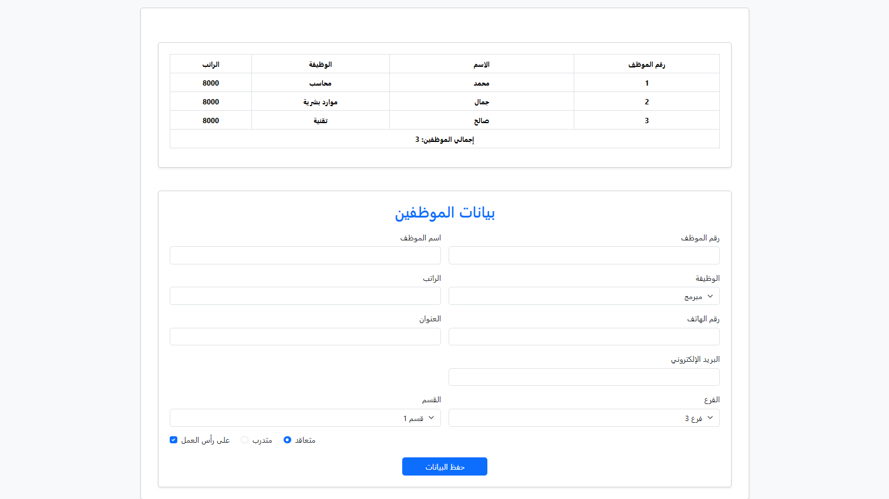

# AspNetCoreMVC-Tuwaiq 🚀
كورس تطوير تطبيقات الويب باستخدام إطار عمل ASP.NET Core MVC

###  اليوم الثالث
جدول ونموذج بيانات الموظفين بلغة HTML و Bootstrap

- إنشاء جدول لعرض بيانات الموظفين وإجمالي عددهم
- بناء نموذج لإضافة موظف جديد باستخدام مكوّنات Bootstrap للجداول والنماذج

**التقنيات المستخدمة:**
- HTML5
- CSS3
- Bootstrap 5
- JavaScript

---

## 🛠️ الأدوات
- [VS Code](https://code.visualstudio.com/)
- [Bootstrap 5](https://getbootstrap.com/)
