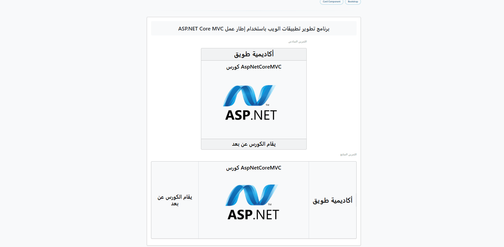
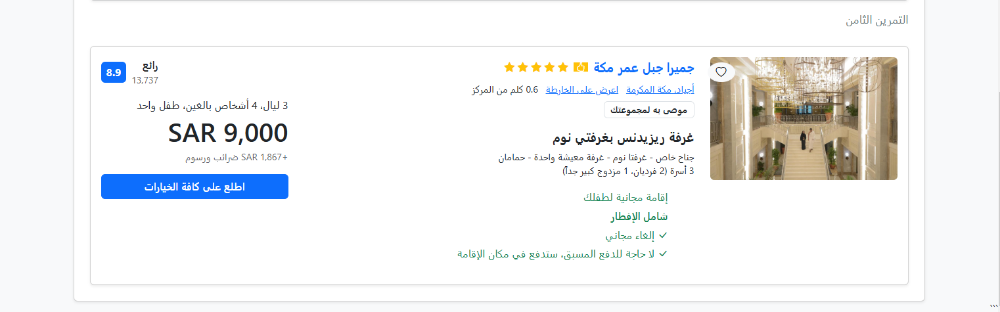

# AspNetCoreMVC-Tuwaiq 🚀
كورس تطوير تطبيقات الويب باستخدام إطار عمل ASP.NET Core MVC

---
### اليوم الرابع
تصميم بطاقات تعريفية بلغة HTML و Bootstrap

- إعادة بناء بطاقة تعريف الكورس بطريقتين مختلفتين باستخدام مكوّن Card
- استخدام نظام Grid (Rows & Columns) لتنظيم العناصر داخل البطاقات

**التقنيات المستخدمة:**
- HTML5
- CSS3
- Bootstrap 5

---

## 🛠️ الأدوات
- [VS Code](https://code.visualstudio.com/)
- [Bootstrap 5](https://getbootstrap.com/)
