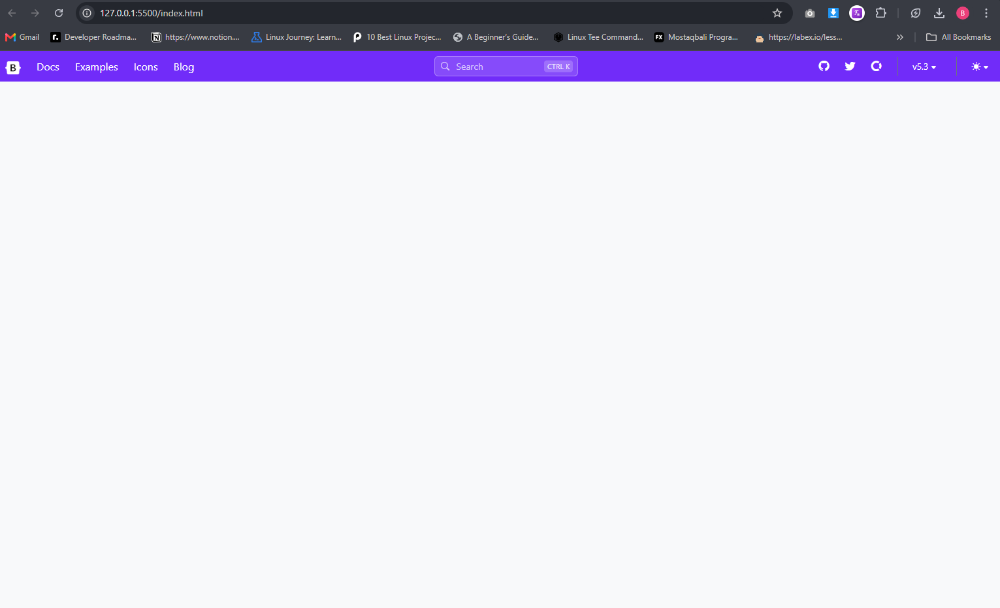

# AspNetCoreMVC-Tuwaiq 🚀
كورس تطوير تطبيقات الويب باستخدام إطار عمل ASP.NET Core MVC

### اليوم الخامس

- بناء شريط تنقل (Navbar) م
- إضافة قائمة منسدلة للثيم
- تضمين خاصية البحث 

**التقنيات المستخدمة:**
- HTML5
- CSS3
- Bootstrap 5

---

## 🛠️ الأدوات
- [VS Code](https://code.visualstudio.com/)
- [Bootstrap 5](https://getbootstrap.com/)
