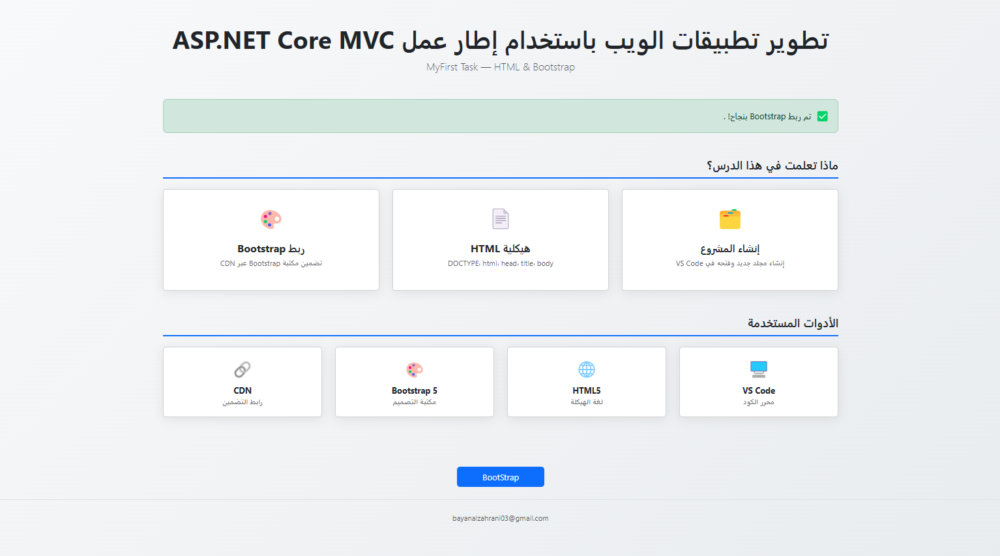

# AspNetCoreMVC-Tuwaiq 🚀

كورس تطوير تطبيقات الويب باستخدام إطار عمل ASP.NET Core MVC

---

###  MyFirst — المهمة الأولى
إنشاء صفحة ويب باستخدام HTML و Bootstrap

**المطلوب:**
- إنشاء مجلد المشروع وفتحه في VS Code
- بناء هيكلية HTML الأساسية
- تضمين مكتبة Bootstrap عبر CDN
- إضافة Alert من Bootstrap
- اختبار الصفحة في المتصفح

**التقنيات المستخدمة:**
- HTML5
- CSS3
- Bootstrap 5
- JavaScript 

---

## 🛠️ الأدوات
- [VS Code](https://code.visualstudio.com/)
- [Bootstrap 5](https://getbootstrap.com/)
