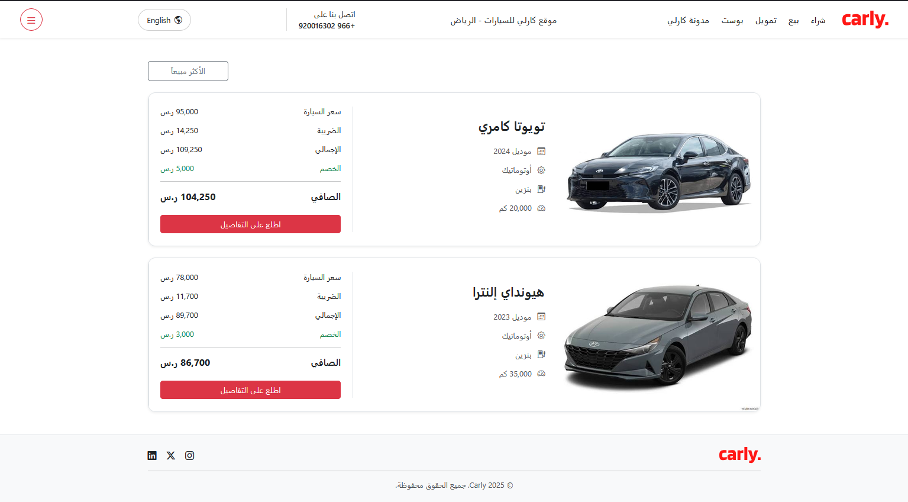

# AspNetCoreMVC-Tuwaiq 🚀

كورس تطوير تطبيقات الويب باستخدام إطار عمل ASP.NET Core MVC

### Project1 

تنفيذ واجهة موقع سيارات حديثة باستخدام Bootstrap 5 مع التركيز على تنظيم المحتوى .

##المميزات

- بناء شريط علوي (Navbar)
- إضافة قائمة منسدلة (Dropdown Menu)
- تصميم بطاقات عرض السيارات (Car Cards)
- إضافة قسم السيارات الأكثر مبيعًا
- إنشاء تذييل الصفحة (Footer)
- تصميم متجاوب باستخدام Bootstrap 5

## التقنيات المستخدمة

- HTML5
- CSS3
- Java Script
- Bootstrap 5

## 🛠️ الأدوات

- VS Code
- Bootstrap 5

