# AspNetCoreMVC-Tuwaiq 🚀

كورس تطوير تطبيقات الويب باستخدام إطار عمل ASP.NET Core MVC

### إنشاء مشروع ASP.NET Core MVC

- تثبيت .NET SDK
- إنشاء مشروع ASP.NET Core MVC
- التعرف على بنية مشروع MVC

# Task 13

إنشاء Action باسم `ShowMessage` تقوم بإرجاع رسالة ترحيبية بسيطة.

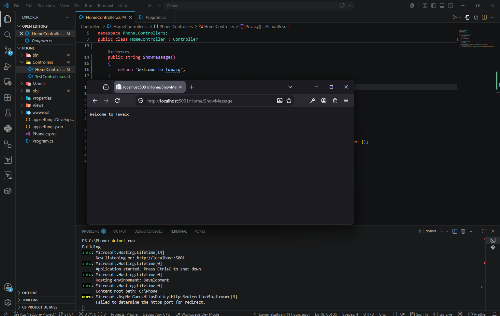

---

## Task 14

إنشاء Action باسم `Square` تستقبل رقمًا وتعيد مربع العدد.

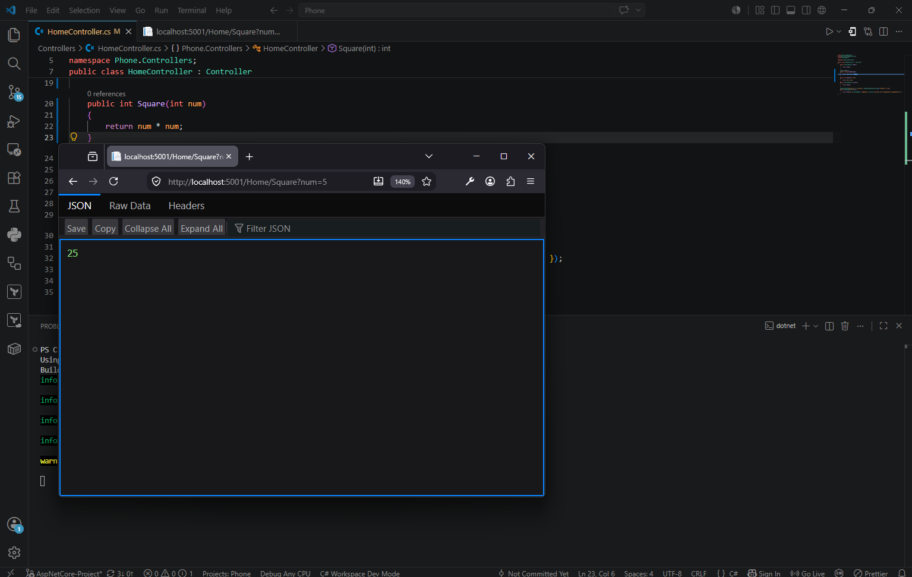

---

## Task 15

إنشاء Action باسم `Square` تستقبل رقمًا وتقوم بطباعة مربع العدد داخل Terminal باستخدام Console.

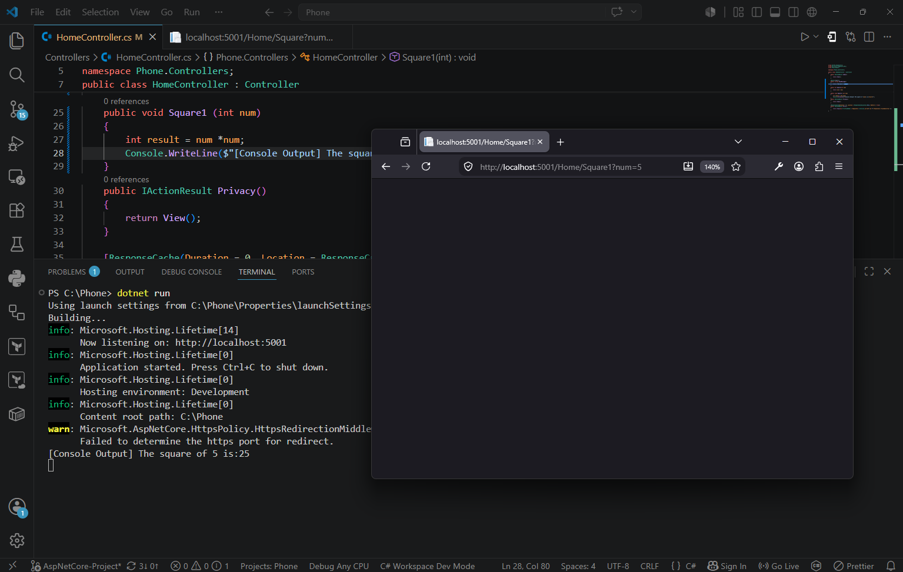

---

## Task 16

إنشاء Action باسم `Add` تستقبل عددين وتعيد ناتج جمعهما.

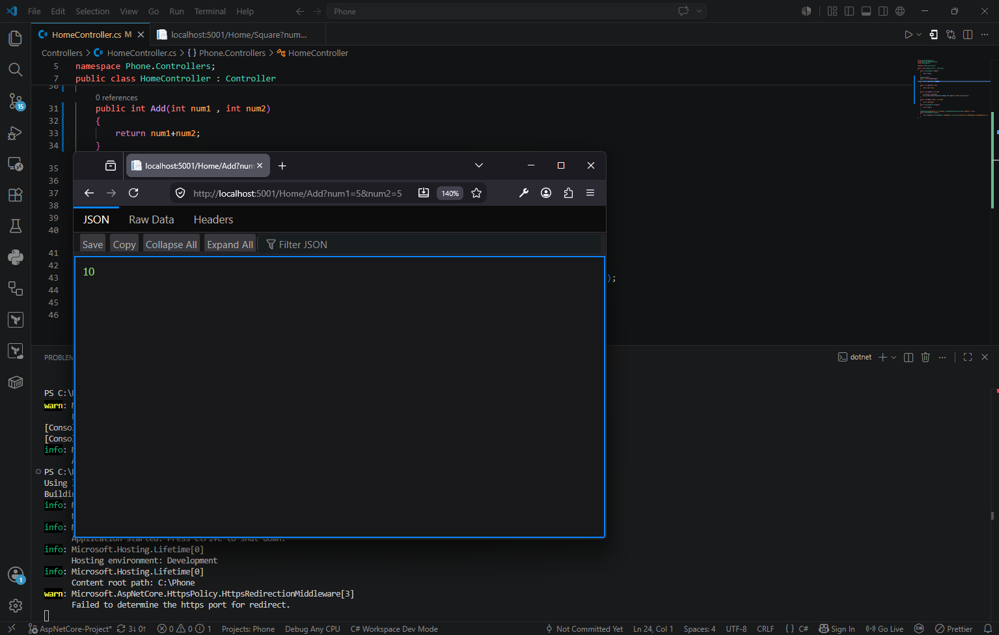

---

## Task 17

إنشاء Controller باسم `TuwaiqController` والتعامل مع Routing وتمرير البيانات عبر URL.

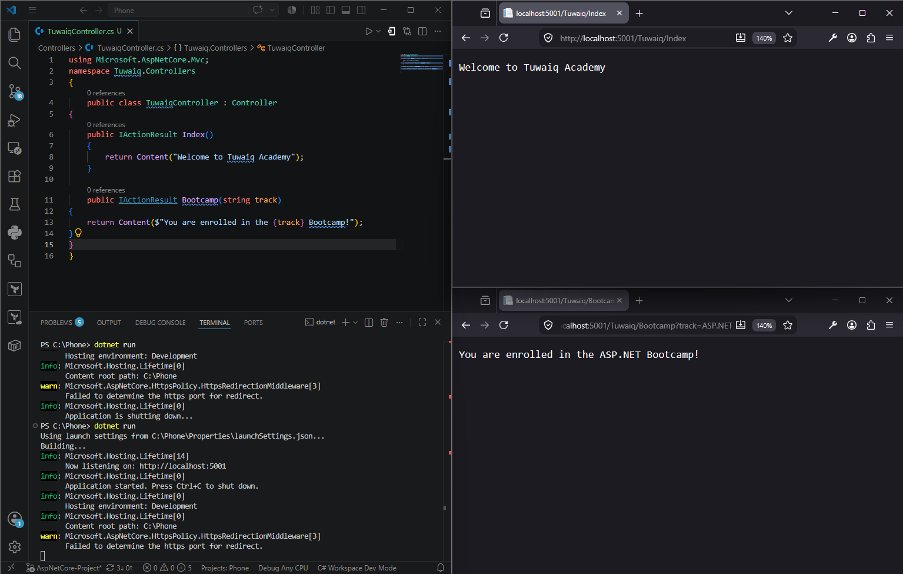

---

## Task 18

التعامل مع Arrays والتحقق عن البيانات المرسلة عبر URL.

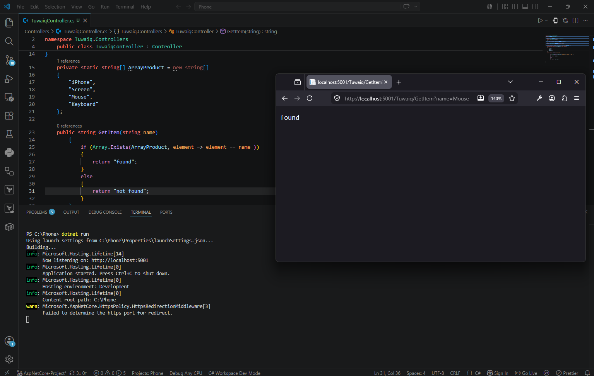

---

## Task 19

التعامل مع Lists واستخدام الدوال الجاهزة للبحث والتحقق من البيانات.

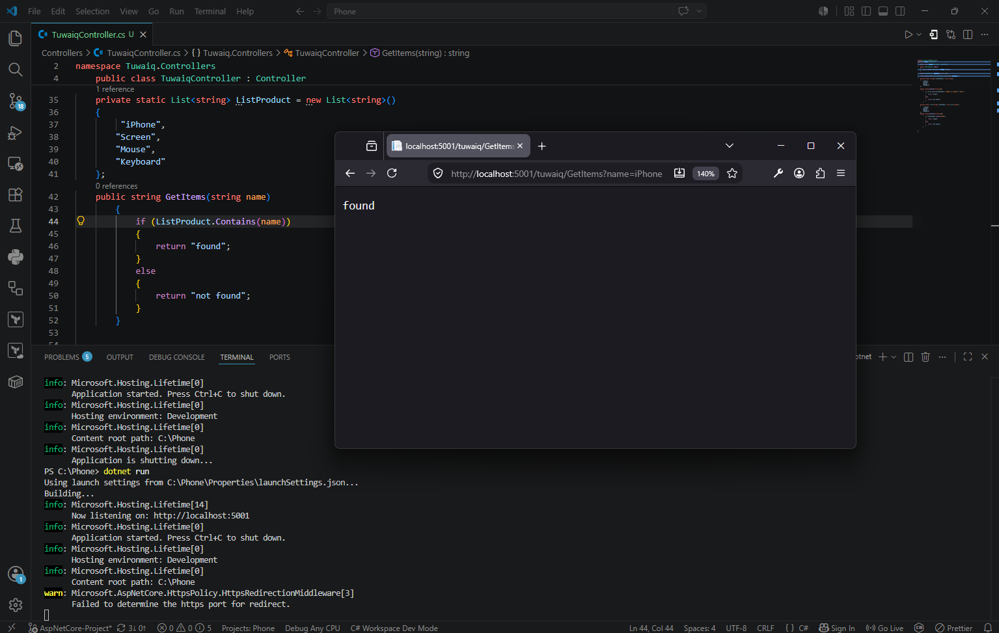

## Task 20

التعامل مع مجموعات البيانات (Dictionaries) والبحث الديناميكي باستخدام ASP.NET Core MVC

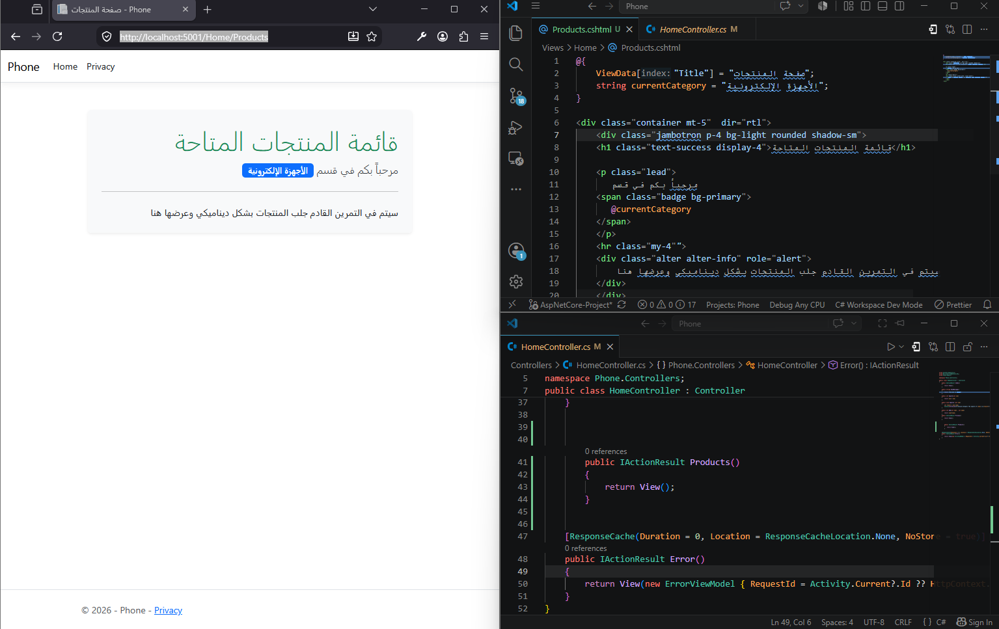

## Task 21

 إنشاء وتوجيه الصفحات في بيئة ASP.NET Core MVC
 
 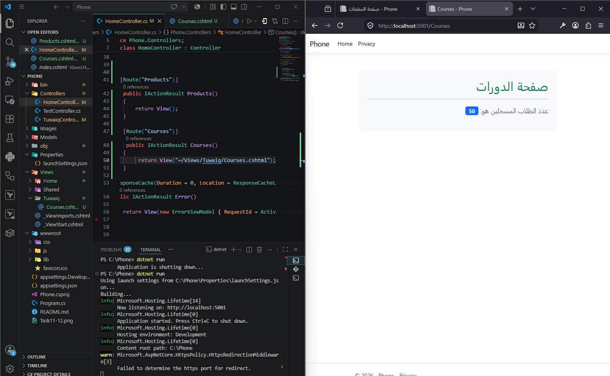.

## Task 22

 
 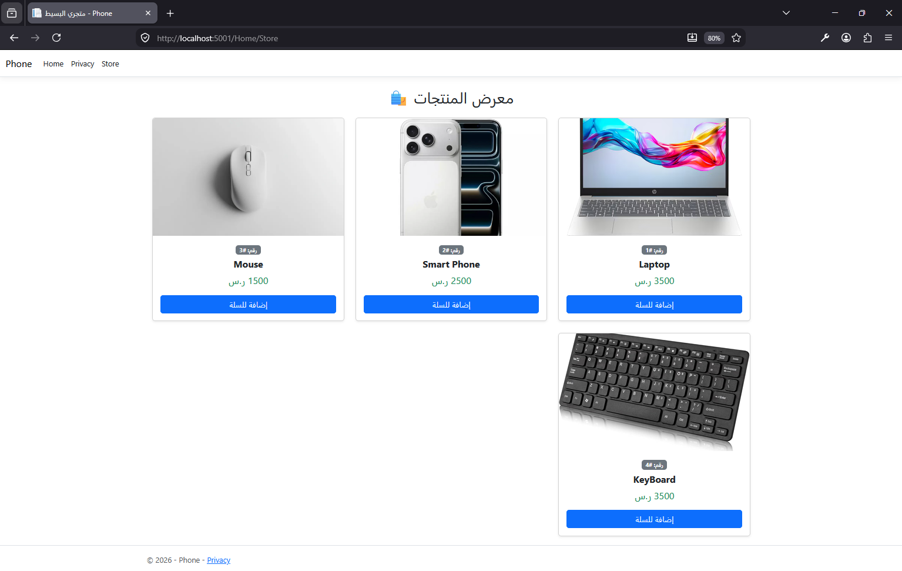

## Task 23

 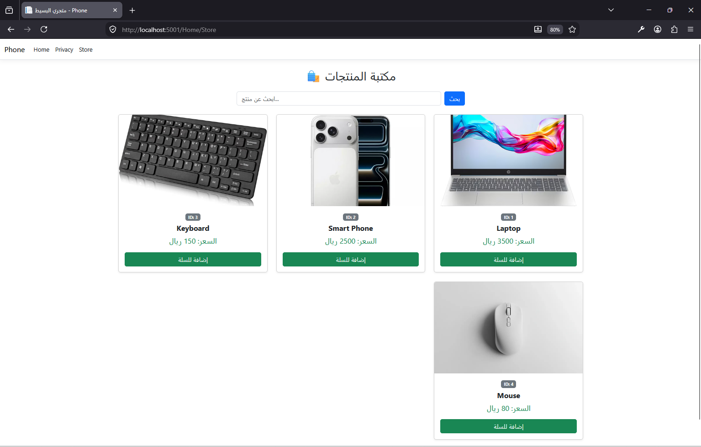
 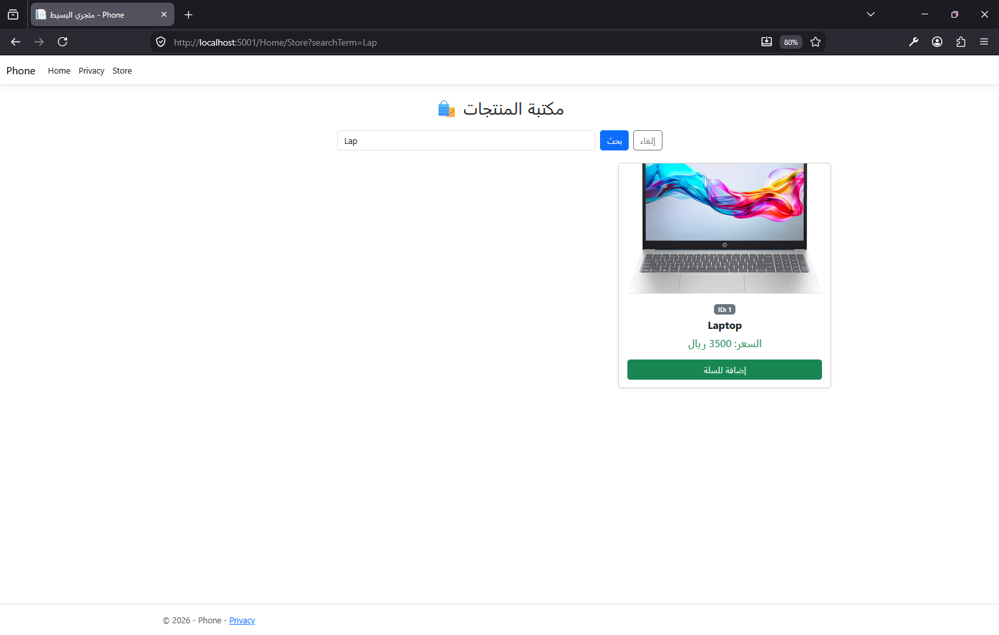.

## 🛠️ الأدوات المستخدمة

- Visual Studio Code
- .NET SDK 10.0.301
- ASP.NET Core MVC
- Git & GitHub

