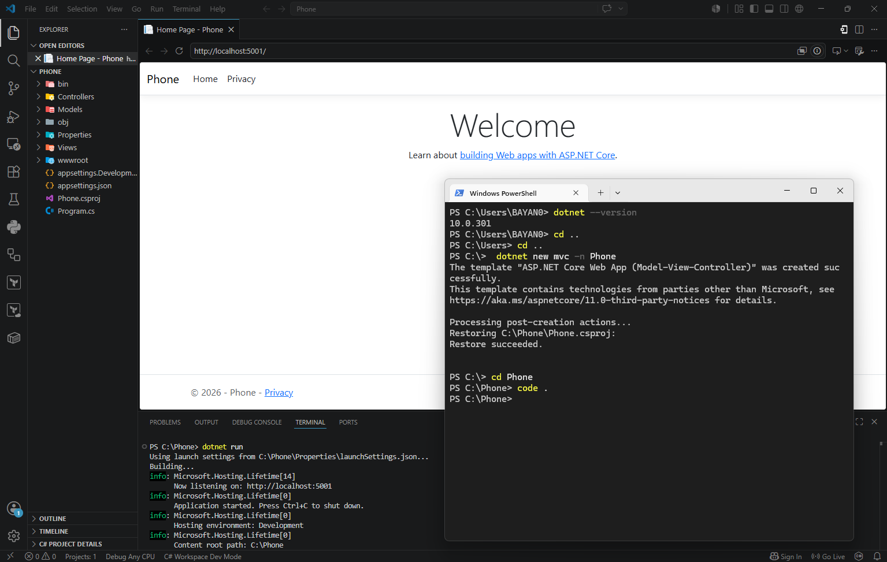

# AspNetCoreMVC-Tuwaiq 🚀

كورس تطوير تطبيقات الويب باستخدام إطار عمل ASP.NET Core MVC

### إنشاء مشروع ASP.NET Core MVC

- تثبيت .NET SDK
- إنشاء مشروع ASP.NET Core MVC
- تشغيل المشروع باستخدام CLI
- فتح المشروع باستخدام Visual Studio Code
- التعرف على بنية مشروع MVC

## 🛠️ الأدوات المستخدمة

- Visual Studio Code
- .NET SDK 10.0.301
- ASP.NET Core MVC
- Git & GitHub

